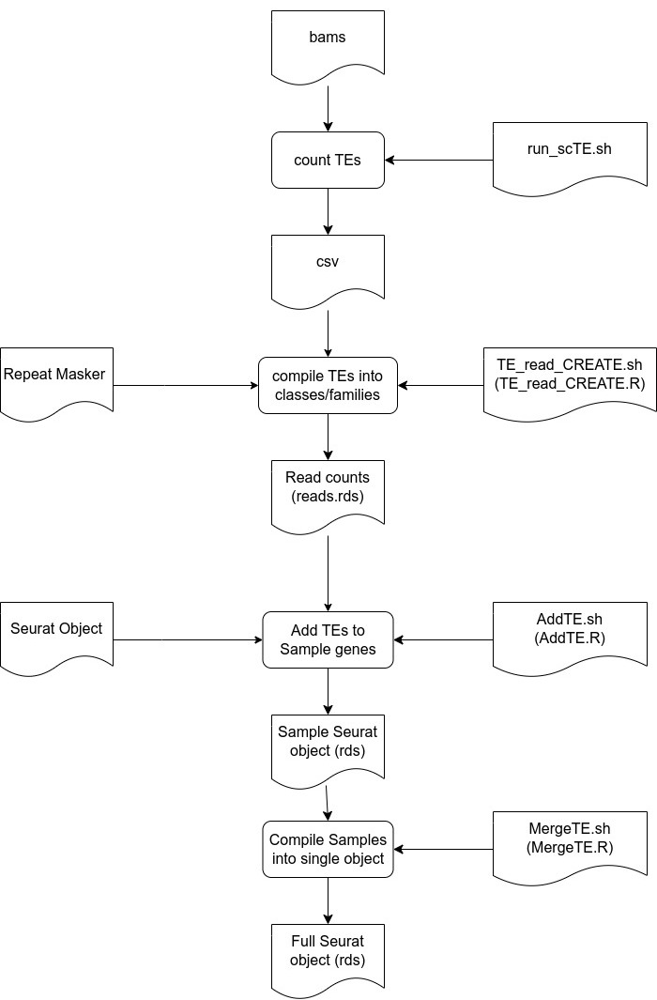

# Alignment and Pseudobulking



1. Raw fastq files from the 10X were aligned using cellranger:

```
sbatch cellranger_count.sh
```


2. TEs are counted using scTE:

```
sbatch run_scTE.sh
```

> :bulb: **N.B.**: This script runs scTE in a conda environment, which is easily acheived using the included yml file:

```
conda env create -f scTE_env.yml
```


3. TE seurat objects are created from the scTE output using 

```
sbatch TE_read_CREATE.sh
```

  ... a wrapper script for *TE_read_CREATE.R*

> :bulb: **N.B.**: This script, and subsequent scripts, rely on running R with Seurat installed in a conda environment, which is easily acheived using the included yml file:
 
```
conda env create -f seurat-env.yml
```


4. Samples TE Seurat objects for samples into gene Seurat objects

```
sbatch AddTE.sh
```

  ... a wrapper script for *AddTE.R*


5. Individual sample TE Seurat objects are merged into a single Seurat Object

```
sbatch MergeTE.sh
```

  .. wrapper script for *MergeTE.R*


6. single cell data was the pseudobulked on the basis of the cell populations

```
sbatch PseudoBulk.sh
```

  ... a wrapper script for *Seurat_PseudoBulk.r*


