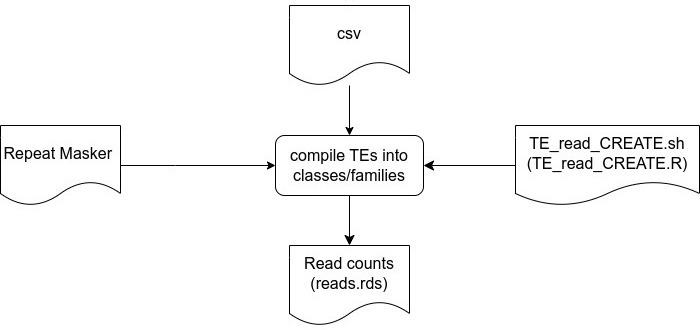

# Alignment and Pseudobulking

<!--  -->

1. Raw fastq files from the 10X were aligned using cellranger:

<div style="display:block;
           margin-left: auto;
           margin-right: auto;
           width: 80%;">

```
sbatch cellranger_count.sh
```

</div>


</img>

2. TEs are counted using scTE:

<div style="display:block;
           margin-left: auto;
           margin-right: auto;
           width: 80%;">

```
sbatch run_scTE.sh
```

</div>


</img>

> bulb: **N.B.**: This script runs scTE in a conda environment, which is easily acheived using the included yml file:
<div style="display:block;
           margin-left: auto;
           margin-right: auto;
           width: 80%;">

```
conda env create -f scTE_env.yml
```

</div>


3. TE seurat objects are created from the scTE output using 

<div style="display:block;
           margin-left: auto;
           margin-right: auto;
           width: 80%;">

```
sbatch TE_read_CREATE.sh
```

  ... a wrapper script for *TE_read_CREATE.R*

</div>


</img>

> :bulb: **N.B.**: This script, and subsequent scripts, rely on running R with Seurat installed in a conda environment, which is easily acheived using the included yml file:
<div style="display:block;
           margin-left: auto;
           margin-right: auto;
           width: 80%;">

```
conda env create -f seurat-env.yml
```

</div>

4. Samples TE Seurat objects for samples into gene Seurat objects

<div style="display:block;
           margin-left: auto;
           margin-right: auto;
           width: 80%;">

```
sbatch AddTE.sh
```

  ... a wrapper script for *AddTE.R*

</div>


</img>


5. Individual sample TE Seurat objects are merged into a single Seurat Object

<div style="display:block;
           margin-left: auto;
           margin-right: auto;
           width: 80%;">

```
sbatch MergeTE.sh
```

  ... wrapper script for *MergeTE.R*

</div>


</img>


6. single cell data was the pseudobulked on the basis of the cell populations

<div style="display:block;
           margin-left: auto;
           margin-right: auto;
           width: 80%;">

```
sbatch PseudoBulk.sh
```

  ... a wrapper script for *Seurat_PseudoBulk.r*

</div>


</img>


